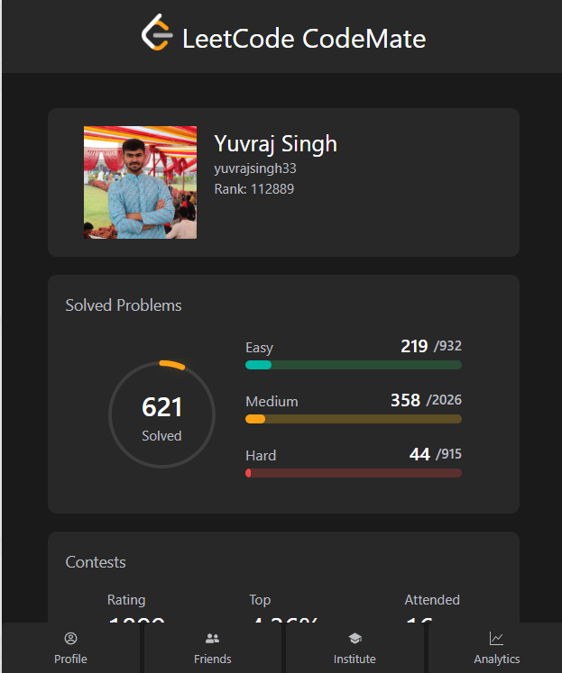
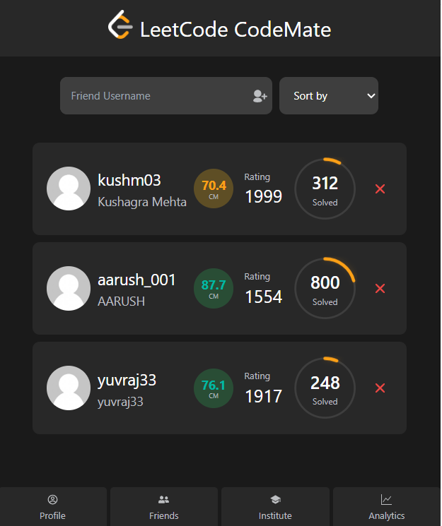
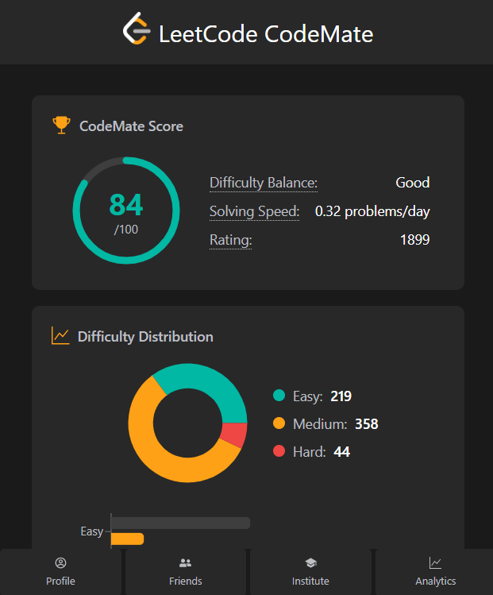
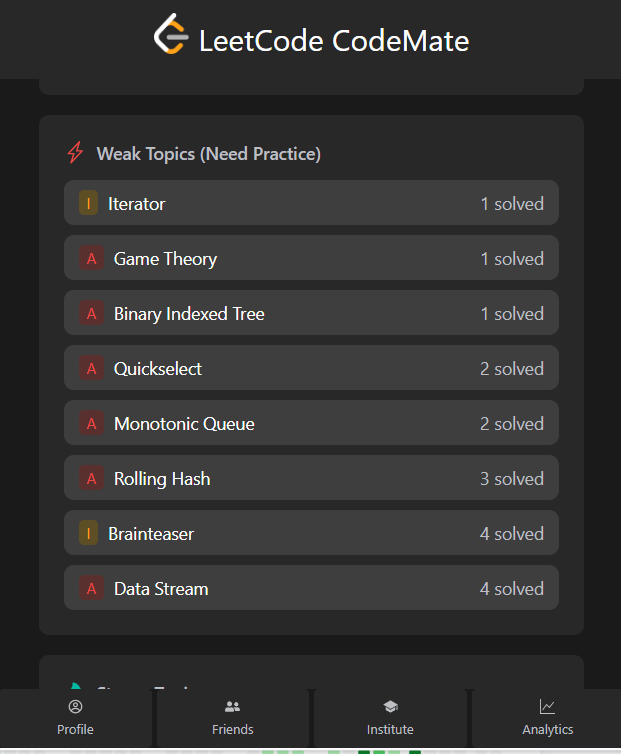
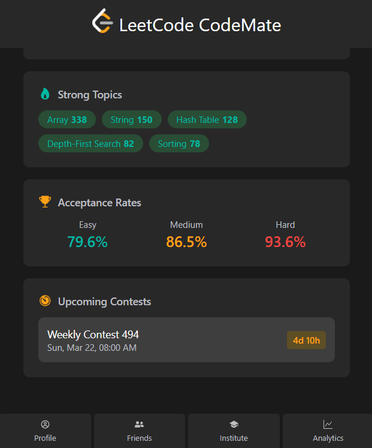

# LeetCode CodeMate

A Chrome Extension + Spring Boot application that enhances your LeetCode experience by tracking your progress, comparing stats with friends, and providing detailed analytics.


## Screenshots

### Profile


### Friends


### CodeMate Score


### Weak Topics


### Strong Topics, Acceptance Rates & Upcoming Contests


## Features

### Profile Dashboard
- View your LeetCode profile with avatar, ranking, and contest stats
- Circular progress indicator for total problems solved
- Difficulty breakdown (Easy / Medium / Hard) with progress bars
- Recent accepted submissions with timestamps

### Friends
- Add and remove friends by LeetCode username
- Compare stats side-by-side with friends
- Sort friends by problems solved, contest rating, alphabetically, or CodeMate Score
- View friend profiles with ratings and problem counts

### Institute / Batchmates
- Create or join an institute (college/organization)
- View all batchmates from your institute
- Compare your progress with batchmates
- Sort batchmates by various metrics

### Analytics
- **CodeMate Score (0-100)** — A custom scoring algorithm based on:
  - Problems solved (max 30 pts)
  - Difficulty balance (max 25 pts)
  - Contest rating (max 25 pts)
  - Acceptance rate (max 10 pts)
  - Consistency (max 10 pts)
- **Difficulty Distribution** — Pie chart and bar chart of solved vs total problems
- **Estimated Days to Target** — Projected days to reach milestones (100, 200, 300, 500, 750, 1000 problems)
- **Weak & Strong Topics** — Topic-wise analysis to identify areas for improvement
- **Acceptance Rates** — Per-difficulty acceptance percentages
- **Upcoming Contests** — List of future LeetCode contests with countdown timers

## Tech Stack

| Layer | Technology |
|-------|-----------|
| Frontend | React 18, TypeScript, TailwindCSS, Vite |
| Backend | Spring Boot 3.2.4, Java 17, Spring Data JPA |
| Database | MySQL 8 |
| Charts | Recharts |
| HTTP Client | Axios |
| Extension API | Chrome Extensions Manifest V3 |

## Prerequisites

- **Node.js** (v18+)
- **Java 17**
- **MySQL 8**
- **Google Chrome**

## Setup & Installation

### 1. Clone the repository

```bash
git clone https://github.com/yuvrajjaat/LeetCode-CodeMate.git
cd LeetCode-CodeMate
```

### 2. Setup the Database

Create a MySQL database:

```sql
CREATE DATABASE leetcode_buddy;
```

Update the database credentials in `server/src/main/resources/application.properties`:

```properties
spring.datasource.url=jdbc:mysql://localhost:3306/leetcode_buddy
spring.datasource.username=your_username
spring.datasource.password=your_password
```

### 3. Run the Server

```bash
cd server
./mvnw spring-boot:run
```

The server will start on `http://localhost:8080`.

### 4. Build the Client

```bash
cd client
npm install
npm run build
```

### 5. Load the Chrome Extension

1. Open Chrome and go to `chrome://extensions`
2. Enable **Developer mode** (top right toggle)
3. Click **Load unpacked**
4. Select the `client/dist` folder
5. Open LeetCode in a new tab — the extension will auto-detect your username

## API Endpoints

### Users
| Method | Endpoint | Description |
|--------|----------|-------------|
| GET | `/api/users` | Get all users |
| GET | `/api/users/{username}` | Get user details |
| POST | `/api/users` | Create a new user |

### Friends
| Method | Endpoint | Description |
|--------|----------|-------------|
| GET | `/api/friends/{username}` | Get friends with profiles |
| POST | `/api/friends` | Add a friend |
| DELETE | `/api/friends` | Remove a friend |

### Institutes
| Method | Endpoint | Description |
|--------|----------|-------------|
| GET | `/api/institutes` | Get all institutes |
| GET | `/api/institutes/{id}` | Get institute by ID |
| POST | `/api/institutes` | Create a new institute |
| PUT | `/api/institutes/set` | Join an institute |
| PUT | `/api/institutes/leave` | Leave an institute |
| GET | `/api/institutes/batchmates/{username}` | Get batchmates |

### Analytics
| Method | Endpoint | Description |
|--------|----------|-------------|
| GET | `/api/analytics/{username}` | Get user analytics |
| GET | `/api/analytics/contests` | Get upcoming contests |

## Project Structure

```
LeetCode-CodeMate/
├── client/                     # Chrome Extension (React + TypeScript)
│   ├── public/
│   │   ├── manifest.json       # Chrome Extension manifest (V3)
│   │   ├── content.js          # Content script for LeetCode pages
│   │   └── images/             # Extension icons
│   ├── src/
│   │   ├── api/api.ts          # API client functions
│   │   ├── components/         # React components
│   │   │   ├── Home/           # Profile, Onboarding
│   │   │   ├── friends/        # FriendList, FriendItem
│   │   │   ├── institute/      # Institute management
│   │   │   ├── analytics/      # Analytics dashboard
│   │   │   └── common/         # Appbar, shared components
│   │   ├── contexts/           # React contexts (User, URL)
│   │   ├── hooks/              # Custom hooks
│   │   ├── pages/              # Route pages
│   │   ├── reducers/           # State reducers
│   │   └── types/              # TypeScript type definitions
│   ├── package.json
│   ├── vite.config.ts
│   ├── tailwind.config.js
│   └── tsconfig.json
│
└── server/                     # Spring Boot Backend
    ├── src/main/java/com/leetcodemate/
    │   ├── LeetCodeMateApplication.java
    │   ├── controller/         # REST controllers
    │   ├── service/            # Business logic
    │   ├── repository/         # JPA repositories
    │   ├── model/              # Entity classes (User, Institute)
    │   ├── dto/                # Data transfer objects
    │   └── config/             # CORS, RestTemplate config
    ├── src/main/resources/
    │   └── application.properties
    └── pom.xml
```

## How It Works

1. **User Detection** — The content script (`content.js`) runs on LeetCode pages and detects the logged-in username from localStorage/DOM
2. **Data Sync** — The extension popup communicates with the Spring Boot backend via REST APIs
3. **LeetCode API** — The backend fetches real-time profile data, contest rankings, and submission stats from LeetCode's GraphQL API
4. **Analytics** — The backend calculates the CodeMate Score and other metrics, returning them to the extension for display
